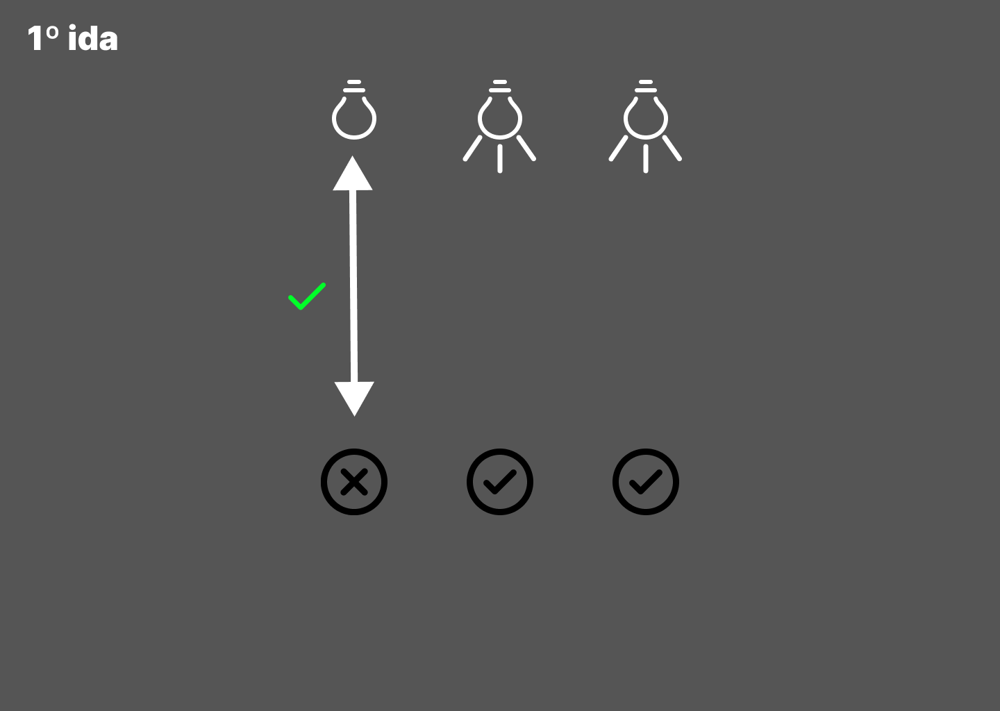
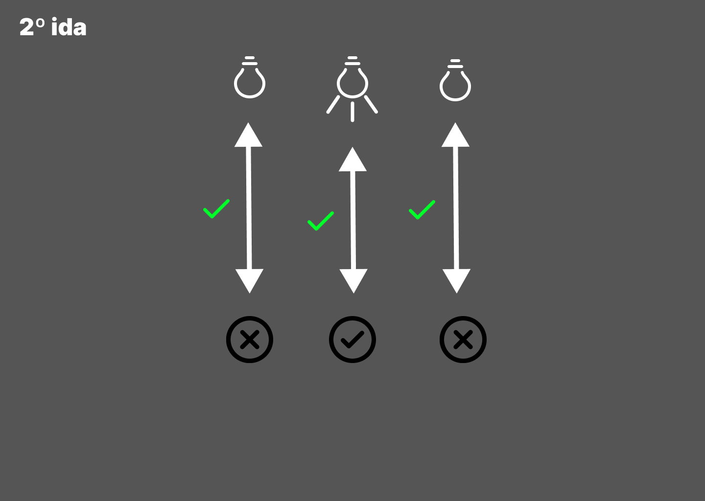

# Desafio 4

Você está em uma sala com três interruptores, cada um conectado a uma lâmpada em uma sala diferente. Você não pode ver as lâmpadas da sala em que está, mas pode ligar e desligar os interruptores quantas vezes quiser. Seu objetivo é descobrir qual interruptor controla qual lâmpada.

Como você faria para descobrir, usando apenas duas idas até uma das salas das lâmpadas, qual interruptor controla cada lâmpada?

**Resposta:** Acendo duas lâmpadas e vou até a sala das lâmpadas.
Desta forma, identifico que o interruptor que está ligado controla a
lâmpada que está acesa. Após isso, volto à sala dos interruptores e
apago uma das lâmpadas ligadas. Dessa forma, na segunda ida, identifico o interruptor
da lâmpada que estava acesa anteriormente e o interruptor da lâmpada que permaneceu acesa.

